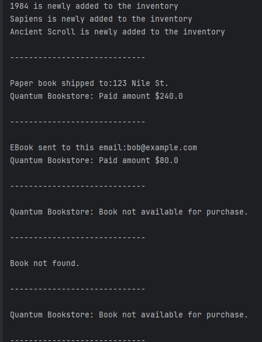
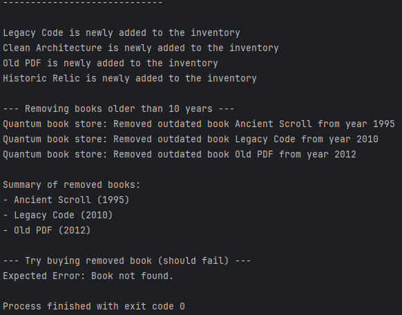

"C:\Program Files\Java\jdk-21\bin\java.exe" "-javaagent:C:\Program Files\JetBrains\IntelliJ IDEA Community Edition 2025.1.3\lib\idea_rt.jar=55520" -Dfile.encoding=UTF-8 -Dsun.stdout.encoding=UTF-8 -Dsun.stderr.encoding=UTF-8 -classpath "C:\Users\lap\IdeaProjects\New folder\Quantum-Bookstore-\out\production\Quantum-Bookstore-" Main
1984 is newly added to the inventory
Sapiens is newly added to the inventory
Ancient Scroll is newly added to the inventory

-----------------------------

Paper book shipped to:123 Nile St.
Quantum Bookstore: Paid amount $240.0

-----------------------------

EBook sent to this email:bob@example.com
Quantum Bookstore: Paid amount $80.0

-----------------------------

Quantum Bookstore: Book not available for purchase.

-----------------------------

Book not found.

-----------------------------

Quantum Bookstore: Book not available for purchase.

-----------------------------

Legacy Code is newly added to the inventory
Clean Architecture is newly added to the inventory
Old PDF is newly added to the inventory
Historic Relic is newly added to the inventory

--- Removing books older than 10 years ---
Quantum book store: Removed outdated book Ancient Scroll from year 1995
Quantum book store: Removed outdated book Legacy Code from year 2010
Quantum book store: Removed outdated book Old PDF from year 2012

Summary of removed books:
- Ancient Scroll (1995)
- Legacy Code (2010)
- Old PDF (2012)

--- Try buying removed book (should fail) ---
Expected Error: Book not found.

Process finished with exit code 0

-
